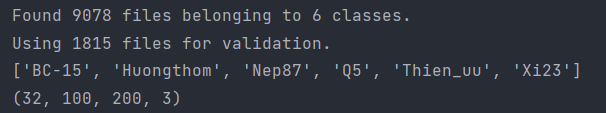
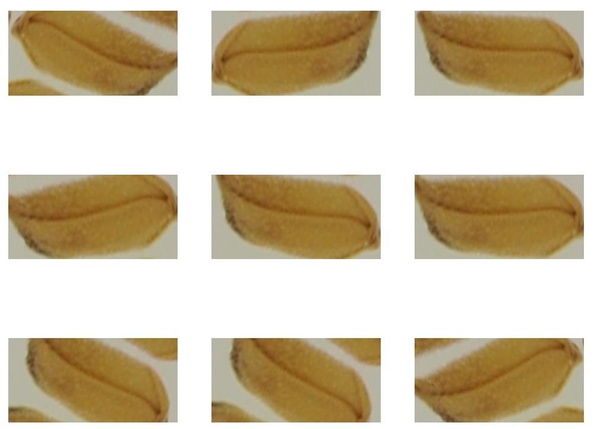

# Rice-classification
Check out my 2 YOUTUBE channels for more:
1. [Mrzaizai2k - AI](https://www.youtube.com/channel/UCFGCVG0P2eLS5jkDaE0vSfA) (NEW)
2. [Mrzaizai2k](https://www.youtube.com/channel/UCCq3lQ1W437euT9eq2_26HQ) (old)

6 Vietnamese rice seed types classification with Tensorflow and 3 other models: normal CNN, Resnet, LeNet

The stupid code for super newbie in this field. I feel stupid when writing this too :((

The dataset has over 9000 images of 6 different rice seeds [BC-15, Thien_uu, Huongthon, Nep87, Q5, Xi23]

I splited the dataset to train/valid/test as 70/20/10. The Images were in different sizes so I have to resizzed them into 1:2 ratio (100x200 pixels) and normalized them into (0-1) range

<i>Figure. Dataset split and Image preprocessing </i>

I also add Augmentation to increase the number of dataset with:
* Flip 
* Zoom in/out
* Rotate

<i>Figure. Augmentation </i>

